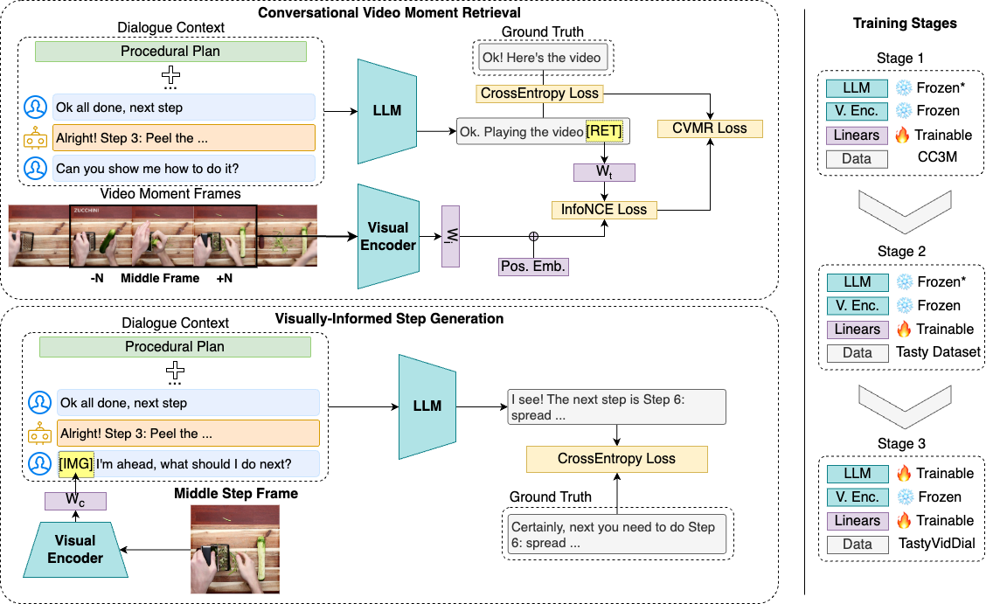

# MM-PlanLLM

This repository is the official implementation of **MM-PlanLLM** introduced in [**Show and Guide:
Instructional-Plan Grounded Vision and Language Model**](https://aclanthology.org/2024.emnlp-main.1191/).

<p align="center">


## Data

You can download the dataset used to train and evaluate MM-PlanLLM [here](https://unlpt-my.sharepoint.com/:f:/g/personal/dmgc_silva_fct_unl_pt/Eu8uynpILhFBvqdIS2m-sh8BZsh7zuDr-P86OTdTUoDCgg?e=QI3ow3). (see disclaimer)

The dataset consists of three files:

* `mmplanllm_dataset_train.json`
* `mmplanllm_dataset_eval.json`
* `mmplanllm_dataset_test.json`

Each file contains a dictionary with dialogues. Each dialogue contains the recipe information and the dialogue turns.

```python
dialogue = {
    "dialog_id": "String - Unique identifier for the dialogue.",
    "task": {
        "recipeId": "String - Unique identifier for the recipe.",
        "recipe": {
            "displayName": "String - Display name of the recipe.",
            "instructions": [
                {
                    "stepNumber": "Integer - The step number in the recipe.",
                    "stepText": "String - The text of the step.",
                    "actions": [
                        {
                            "actionText": "String - The text of the step that matches this action.",
                            "framesPath": "String - Path to the frames of the action. You need to update this to the folder with your copy of Tasty Dataset",
                            "startFrame": "Integer - The start frame of the action.",
                            "middleFrame": "Integer - The middle frame of the action.",
                            "endFrame": "Integer - The end frame of the action.",
                        }
                    ],
                },
            ]
        }
    },
    "dialog": [
        {
            "current_step": "Integer - The current step in the recipe after the user request.",
            "user": "String - The user request.",
            "system": "String - The system response.",
            "negative_response": "String - A negative response, used for preference optimization if needed.",
            "visual_request": "Boolean - True if either the user request or the system response contain visual information.",
            "relevant_image": "String - Path to the relevant image if visual_request is True, otherwise None."
        },
    ],
    "system_tone": "String - The tone of the system response (very_polite, polite, somwhat_polite, neutral)."
}
```

To obtain the videos and the frames for these recipes you need to download the [Tasty Dataset](https://cvml.comp.nus.edu.sg/tasty/download.html) and extract the frames to the folder specified in the `framesPath` field.

**NOTE: After obtaining the frames, you need to reduce the number of frames to match our indexes. Specifically, we only kept 1 in every 20 frames (see `frame_reducing.py`). Alternatively, multiply the indexes by 20 but keep in mind that recall will be lower due to the larger retrieval space.**

**DISCLAIMER: These are not the exact files used for testing and training. To avoid sharing any personal or proprietary information, in these files the user request was generated using LLAMA2. Our tests show no performance loss when using the generated user requests.**
## Training

To train MM-PlanLLM, run the following command or run the script `scripts/mmplanllm_llama2.sh`:

```bash
torchrun --nnodes 1 --nproc_per_node 1 --master_port $MASTER_PORT src/main.py \
    --run_name mmplanllm_llama2 \
    --project_name mmplanllm \
    --base_model 'meta-llama/Llama-2-7b-hf' \
    --ckpt_path /path/to/your/model \
    --overwrite_output_dir True \
    --data_path /data/dmgc.silva/datasets/ \
    --dataset_type plangpt_dataset \
    --dataset_name plangpt_dataset_3.1 \
    --num_train_epochs 1 \
    --per_device_train_batch_size 4 \
    --per_device_eval_batch_size 4 \
    --gradient_accumulation_steps 4 \
    --evaluation_strategy no \
    --eval_steps 500 \
    --save_strategy steps \
    --save_steps 500 \
    --max_steps 2000 \
    --save_total_limit 10000 \
    --warmup_steps 100 \
    --learning_rate 0.0005 \
    --lr_step_size 400 \
    --lr_num_cycles 10 \
    --weight_decay 0.0 \
    --warmup_ratio 0.03 \
    --adam_beta1 0.9 \
    --adam_beta2 0.95 \
    --adam_epsilon 1e-8 \
    --max_grad_norm 1.0 \
    --lr_scheduler_type "constant" \
    --logging_steps 5 \
    --seq_max_length 30 \
    --perpetual False \
    --report_to_wandb True \
    --infer_checkpoints True \
    --infer_file "infer_checkpoint.sh" \
    --load_dtype BF16 \
    --load_in_8bits False \
    --mixed_precision BF16 \
    --warmup_before_inference 0 \
    --reload_optimizer False \
    --parallel_type NO \
    --use_half False \
    --lora True \
    --lora_alpha 8 \
    --lora_rank 4 \
    --lora_dropout 0.1 \
    --debug False \
    --dataset_kwargs "{'feature_extractor_model': 'openai/clip-vit-large-patch14', 'context_size': 3, 'max_len':800, 'only_visual': True, 'only_text': False, 'n_adjacent_frames': 2 }" \
    --freeze_emb False \
    --use_pos_emb True \
    --freeze_lm False \
    --freeze_vm True \
    --text_decoder 'meta-llama/Llama-2-7b-hf' \
    --visual_encoder "openai/clip-vit-large-patch14" \
    --n_visual_tokens 1 \
    --image_embed_dropout_prob 0.0 \
    --shared_emb_dim 512 \
    --text_embed_dropout_prob 0.1 \
    --ret_loss_scale 1.0 \
    --cap_loss_scale 1.0
```

For clarification on each field please consult the `src/data_binding.py` file.

## Evaluation

We evaluate MM-PlanLLM on three different tasks and provide scripts for each of them:

* **Conversational Video Moment Retrieval:**

    `sh scripts/infer_planllmvmr.sh /path/to/your/model /path/to/your/dataset`
* **Visually-Informed Step Generation:** 

    `sh scripts/infer_planllmtsr.sh /path/to/your/model /path/to/your/dataset`
* **Plan Grounded Text Generation:** 

    `sh scripts/infer_gen_checkpoint.sh /path/to/your/model /path/to/your/dataset`

The evaluation results are reported in the paper.

## Model

Please use the following link to download the MM-PlanLLM model weights [here](https://unlpt-my.sharepoint.com/:f:/g/personal/dmgc_silva_fct_unl_pt/EsWVbIBgbKJHhgi8QJ01bxMBblaI4nI2VvcdvPD1kRVZXA?e=UYbnnh) (~11G).

## Citation

If you use MM-PlanLLM in your research or find this code useful, please cite our paper:

```
@inproceedings{gloria-silva-etal-2024-show,
    title = "Show and Guide: Instructional-Plan Grounded Vision and Language Model",
    author = "Gl{\'o}ria-Silva, Diogo  and
      Semedo, David  and
      Magalhaes, Joao",
    editor = "Al-Onaizan, Yaser  and
      Bansal, Mohit  and
      Chen, Yun-Nung",
    booktitle = "Proceedings of the 2024 Conference on Empirical Methods in Natural Language Processing",
    month = nov,
    year = "2024",
    address = "Miami, Florida, USA",
    publisher = "Association for Computational Linguistics",
    url = "https://aclanthology.org/2024.emnlp-main.1191",
    pages = "21371--21389"
}
```

Follow me on Twitter: [@dmgcsilva](https://x.com/dmgcsilva) (I am not very active but I like to lurk)
